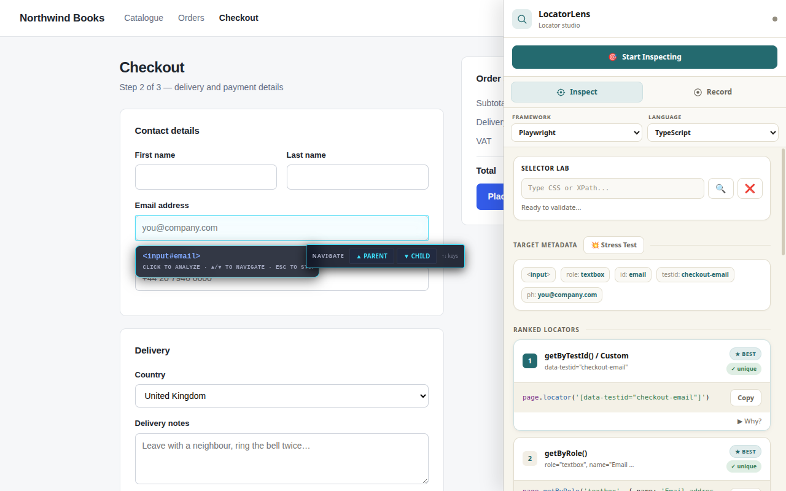

# LocatorLens — locator inspector & test recorder

[]()
[]()
[](https://opensource.org/licenses/MIT)

**LocatorLens** is a browser extension for end-to-end test authoring: inspect any element to get **ranked, uniqueness-checked locators**, validate selectors, and **record a flow into a runnable test** — all from the side panel. Output targets **Playwright, Selenium, or Cypress** in **TypeScript, JavaScript, or Python** (Cypress is JS/TS only).

Extension version is defined in `manifest.json` (currently **1.2.1**) and kept in step
with `package.json` and both browser manifests by `node scripts/version.mjs`.

---

## Key features

### Frameworks & languages

- Pick a **framework** (Playwright · Selenium · Cypress) and **language** (TypeScript · JavaScript · Python) from the side-panel bar — inspector cards and recorder output update instantly. Cypress is JS/TS only (Python is shown but disabled).
- Translation lives in `codegen.js`, a pure module shared by the inspector, the recorder, and the right-click “Copy Best Locator”.

### Inspector and ranked locators

- Semantic-first ranking (`getByTestId`, `getByRole`, `getByLabel`, …) via `content-locator-engine.js`.
- **Live uniqueness:** every card shows whether the locator matches **exactly one** element (✓ unique) or **several** (⚠ N matches), checked against the real page.
- Stability hints, accessibility notes, and a “why this locator” explanation per card.

### Shadow DOM–aware picking

- Coordinate-based deep hit testing so targets inside **open shadow roots** can be inspected and described.

### DOM traversal while inspecting

- **Arrow Up / Down** to move between parent and child elements; **Escape** to stop.

### Selector lab

- Type a **CSS selector**, an **XPath**, or a **full Playwright locator** in the side panel to **highlight matches** on the active page (with counts and errors surfaced in the UI). The first match is scrolled into view, and the status line names the method that resolved it (e.g. _“via getByRole()”_).
- **Playwright locators are resolved live against the DOM** — paste a generated line verbatim, including `await`, the `page.` handle, and a trailing action, and the Lab strips the boilerplate and highlights the target:
  ```js
  await page.getByRole('textbox', { name: 'Username or Email' }).fill('your value');
  ```
  Supported: `getByRole` (with `name` / `exact`), `getByLabel`, `getByPlaceholder`, `getByText`, `getByTestId`, `getByTitle`, `getByAltText`, and `locator('css' | '//xpath')` — plus chained scoping (`a.locator(b)`), positional reducers (`.first()` / `.last()` / `.nth(n)`), and `.filter({ hasText })`.

### Stress test

- Pick an element, then click **💥 Stress Test** to check whether it stays **locatable without its `id`/`class`** — i.e. whether its semantic role + accessible name uniquely identify it on the page. The result names what was tested (tag · role · name) and reports **Yes ✅ / No ❌**.
- Operates on the **element you picked** (it persists after you stop inspecting), guides you when nothing is selected, and reports clearly when a page can’t be reached (e.g. `chrome://`, the Web Store, PDFs).

### Recorder (side panel)

- Captures clicks, typing (debounced fills), selects, key presses, **hovers** (Alt+click), and **assertions** (visible / has-text / has-value / enabled / checked).
- **Pause/resume**, **undo/redo**, a **filterable, collapsible timeline**, and recording that **survives full-page navigation**.
- Produces an editable, **syntax-highlighted** test script in your chosen framework + language; copy or download.

### Clean, theme-aware UI

- Warm, minimal side panel and popup with automatic **light/dark mode** (follows your OS preference).

---

## Quick start

```bash
npm ci
npm run build          # writes dist/chrome/, dist/firefox/ and a .zip for each
```

### Chrome, Edge, or Brave

1. Open `chrome://extensions`.
2. Enable **Developer mode**.
3. **Load unpacked** → select **`dist/chrome`**.

### Firefox

1. Open `about:debugging#/runtime/this-firefox`.
2. **Load Temporary Add-on…** → select **`dist/firefox/manifest.json`**.

To load straight from the source tree instead, run `./setup.sh chrome`
(or `setup.bat chrome` on Windows) to put the right manifest at the project root,
then load the root folder. Use `dist/` for anything you intend to submit — see
[STORE_SUBMISSION.md](STORE_SUBMISSION.md).

---

## Development

| Command                 | What it does                                                                                                           |
| ----------------------- | ---------------------------------------------------------------------------------------------------------------------- |
| `npm run lint`          | ESLint over `src/`, `scripts/`, `tests/`                                                                               |
| `npm test`              | Vitest — 204 tests across codegen, locator engine, content scripts, the service worker, rendering and package contents |
| `npm run build`         | Reproducible Chrome + Firefox packages in `dist/`                                                                      |
| `npm run version:check` | Assert `package.json` and all three manifests agree                                                                    |
| `npm run screenshots`   | Capture store listing images from the built extension                                                                  |
| `npm run smoke`         | Drive the built extension in a real browser (27 end-to-end checks)                                                     |
| `npm run verify`        | Version check + lint + tests + build — run this before submitting                                                      |

`npm run build` selects files from an explicit allowlist and **fails** if the result
would contain remote code, `eval`, a network API, a stray file, a manifest reference
it cannot satisfy, or a permission the code does not actually use. Never zip the
repository root — see [STORE_SUBMISSION.md](STORE_SUBMISSION.md).

---

## Screenshots



Pick any element and the side panel ranks every way to address it, each checked for
uniqueness against the live page. More in [`screenshots/store/`](screenshots/store/),
all generated by `npm run screenshots` from the built extension.

---

## Project layout

```text
├── src/
│   ├── background.js           # Extension service worker / messaging
│   ├── codegen.js              # Framework/language code generation (pure module)
│   ├── content-locator-engine.js  # Locator ranking + live uniqueness (injected first)
│   ├── content.js              # Overlay, inspect, recorder, selector lab
│   ├── sidepanel.js / .html    # Main UI: inspect + record
│   ├── popup.js / .html        # Compact launcher
├── manifests/                  # Browser-specific manifest variants
├── scripts/
│   ├── build.mjs               # Allowlist packaging + store-policy gate
│   ├── version.mjs             # Keeps package.json + all manifests in step
│   └── screenshots/            # Demo page + capture script for listing images
├── tests/                      # Vitest suites
├── screenshots/store/          # Store listing images (regenerable)
├── icons/
└── manifest.json               # Primary manifest — a copy of one manifests/ variant
```

Also: [STORE_SUBMISSION.md](STORE_SUBMISSION.md) (submission process and permission
justifications), [build_process.md](build_process.md) (architecture),
[CHANGELOG.md](CHANGELOG.md), [PRIVACY_POLICY.md](PRIVACY_POLICY.md).

---

## Permissions

LocatorLens requests only what it needs to inspect pages and drive the side panel locally — there is no network/host call to any LocatorLens server.

| Permission                                        | Why it’s needed                                                            |
| ------------------------------------------------- | -------------------------------------------------------------------------- |
| `activeTab`                                       | act on the tab you’re currently viewing                                    |
| `scripting` + host access (`<all_urls>`)          | inject the inspector/recorder content scripts into the page you’re testing |
| `storage`                                         | remember your last pick, recorder timeline, and framework/language choice  |
| `contextMenus`                                    | the right-click “Copy Best Locator” / “Open Panel” entries                 |
| `sidePanel` (Chrome) · `sidebar_action` (Firefox) | the side-panel / sidebar surface                                           |

`tabs` is deliberately **not** requested — everything the extension does with
`chrome.tabs` works without it, and the build fails if it ever reappears.

Cross-browser: the same `src/` runs on both; Chrome loads a service-worker background, Firefox a module background script, and the Firefox manifest declares `gecko.id`, `strict_min_version: 142.0`, and `data_collection_permissions: none`. See `build_process.md` §11 for the full breakdown.

## Engineering notes

- **Semantic-first**: prefer roles, labels, and test ids over long CSS chains or positional selectors when the DOM exposes them.
- **Privacy**: no LocatorLens-operated cloud; see `PRIVACY_POLICY.md`.

**Repository:** [github.com/yogesh-bhatttk/Locator_Lens](https://github.com/yogesh-bhatttk/Locator_Lens)
